# LEGO Fidelity v3 Implementation Plan

Status: proposed for implementation

Baseline branch: `codex/lego-pilot`

Baseline commit: `4010dafb`

Primary benchmark: Contemporary Midrise variants 0–3

Target: at least 90/100 design-feature fidelity for every benchmark family

## 1. Purpose

The schema-v2 pilot proved that a deterministic modular builder can produce
recognizable archetype families. Its 75–82/100 scores also exposed the next
constraint: the remaining quality gap is primarily architectural geometry and
composition, not prompt wording or texture resolution.

This plan upgrades the system to Building Grammar v3. The new system will
represent facade zones, floor variants, corners, openings, attachments, crowns,
and signature features as typed data, then use that data to build modular GLBs
that preserve the selected archetype's identity in Blender and the globe.

Reference material:

- `docs/CODEX_LEGO_PILOT.md`
- `docs/lego_pilot/pilot_showcase.png`
- `docs/lego_pilot/*_comparison.png`

## 2. Goals

- Make every benchmark variant identifiable without its label.
- Preserve exact footprint, floor count, overall height, frontage direction,
  setback logic, and roof intent.
- Replace pasted-on window boxes with facade meshes containing real openings,
  reveals, jambs, sills, lintels, frames, and glazing.
- Support deterministic multi-floor variation without random visual noise.
- Represent archetype-specific signature features as reusable modules rather
  than hard-coded one-off Blender branches.
- Preserve traceability from catalogue prose to grammar to manifest to library
  metadata to the placed runtime instance.
- Provide automatic geometry, contract, visual-review, and performance gates.
- Keep the modules efficient enough for neighborhood-scale globe scenes.

## 3. Non-goals

- Do not generate an entire building or presentation board as one AI image.
- Do not allow the 3D builder to invent a different footprint or site plan.
- Do not use unconstrained random facade layouts.
- Do not solve all 223 building archetypes in this increment.
- Do not model detailed interiors, furniture, people, or photogrammetric trees.
- Do not replace the deterministic board compositor or the 2D/3D provider
  routing described in `AGENTS.md`.

## 4. Success criteria

### Visual fidelity

Each benchmark is scored out of 100 using the existing explicit rubric:

| Criterion | Weight | Release threshold |
|---|---:|---:|
| Massing and floors | 25 | 24 |
| Material and palette | 25 | 22 |
| Facade rhythm | 25 | 22 |
| Signature features | 25 | 20 |
| Total | 100 | 90 |

Additional visual gates:

- Five reviewers can identify the correct variant from an unlabeled render at
  least 80% of the time.
- Reference and generated review images use documented, repeatable camera
  families: three-quarter, street, facade, and aerial.
- No window is covered by its frame or wall layer.
- No visible z-fighting, open seams, inverted normals, razor-edged major
  masses, or accidental material substitution.

### Geometry and performance

| Budget | Target |
|---|---:|
| Repeatable floor LOD0 | under 20,000 triangles |
| Assembled building LOD0 | under 120,000 triangles |
| Core materials per family | 8 or fewer |
| Compressed repeatable module | under 5 MB |
| Close-view draw calls per assembled family | 12 or fewer |
| Desktop target | 60 FPS with 25 visible assemblies |
| Integrated-GPU target | 30 FPS with 25 visible assemblies |

Every GLB must continue to pass origin, axis, dimension, height, footprint,
material-count, triangle-count, and file-size validation.

## 5. Architectural approach

```mermaid
flowchart LR
    A["Catalogue archetype + selected variant"] --> B["Fidelity specification"]
    B --> C["Building Grammar v3"]
    C --> D["Facade graph"]
    D --> E["Geometry primitives"]
    E --> F["Module variants + LODs"]
    F --> G["Manifest v3"]
    G --> H["Library import"]
    H --> I["Deterministic assembly plan"]
    I --> J["Three.js globe rendering"]
    J --> K["Golden-image and performance gates"]
```



The facade graph is the important new boundary. `compiler.py` will describe
architectural intent; Blender code will consume a renderer-neutral graph. This
prevents catalogue interpretation, geometry construction, materials, and
presentation rendering from growing into one monolithic script.

## 6. Building Grammar v3 contract

Schema v3 should add the following typed concepts while retaining the v2
dimensions, source provenance, massing, roof, and materials.

### 6.1 Facade zones

```python
FacadeZoneKind = Literal["base", "middle", "upper", "crown"]

class FacadeZone:
    kind: FacadeZoneKind
    start_level: int
    end_level: int
    primary_material_slot: str
    bay_pattern_id: str
    floor_variant_sequence: list[str]
    projection_m: float = 0.0
    inset_m: float = 0.0
```

Zones establish base/middle/top composition without baking floor numbers into
Blender functions.

### 6.2 Openings and bays

```python
OpeningKind = Literal[
    "window", "door", "curtain_wall", "juliet_door", "shopfront"
]

class OpeningSpec:
    kind: OpeningKind
    width_ratio: float
    height_ratio: float
    sill_m: float
    reveal_depth_m: float
    frame_profile_id: str
    mullion_pattern: str

class BaySpec:
    id: str
    width_m: float
    opening: OpeningSpec | None
    material_slot: str
    projection_m: float = 0.0
    attachment_ids: list[str]
```

### 6.3 Floor patterns

```python
class FloorVariant:
    key: str                 # typical_a, typical_b, feature, upper, crown
    bay_sequence: list[str]
    left_corner_id: str
    right_corner_id: str
    slab_edge_profile_id: str
    allowed_levels: list[int] | None
    repeat_every: int | None
```

The sequence must be deterministic. A family may alternate `typical_a` and
`typical_b`, place `feature` on explicit levels, and finish with `upper` or
`crown`. Random selection is not part of the contract.

### 6.4 Attachments and signature features

```python
AttachmentKind = Literal[
    "balcony", "juliet", "planter", "oriel", "canopy",
    "portal", "arch", "colonnade", "screen", "cornice"
]

class AttachmentSpec:
    id: str
    kind: AttachmentKind
    geometry_profile_id: str
    material_slots: list[str]
    anchor: str
    width_bays: int = 1
    height_floors: int = 1
```

Multi-floor attachments such as brick oriels are compiled as their own
modules, not duplicated inside every repeatable floor GLB.

### 6.5 Sides and corners

Each grammar must explicitly describe `front`, `rear`, `left`, and `right`.
Corner modules join adjacent facade systems cleanly and may carry corner
glazing, masonry returns, chamfers, or wrapped material bands.

### 6.6 Compatibility

- `BuildingGrammar.from_dict()` continues to read schema v2 and upgrades it to
  regular v3 zones and a single `typical_a` floor variant.
- The compiler emits schema v3 only after all consumers accept it.
- Schema version errors remain actionable and name the command required to
  recompile.

## 7. Manifest v3 and assembly contract

### 7.1 Module identity

Every stackable module is identified by:

```text
family + role + variant_key + lod
```

Example:

```json
{
  "role": "floor",
  "variant_key": "typical_b",
  "lod": 0,
  "filename": "mass-timber_floor_typical-b_lod0.glb",
  "repeatable_z": true,
  "allowed_levels": [2, 4, 6],
  "width_m": 22.0,
  "depth_m": 20.0,
  "height_m": 3.4
}
```

### 7.2 Supported roles

```text
podium
floor
feature
setback
crown
roof
attachment
assembled
```

### 7.3 Deterministic recipe

The planner should be able to emit:

```text
podium
floor:typical_a
floor:typical_b
feature:oriel_start
floor:typical_a
feature:oriel_end
setback:upper
crown:green_roof
roof:flat
```

The output recipe remains renderer-neutral and includes `variant_key`, `lod`,
level, native dimensions, placement, and source feature ids.

### 7.4 Import and cache behavior

- Storage keys include `variant_key` and `lod` to avoid collisions.
- Database deduplication uses `family + role + variant_key + lod`.
- Model URLs retain the content-hash query parameter introduced in v2.
- Re-importing one module updates that entry without invalidating siblings.
- Manifest v2 remains importable as `variant_key=default`, `lod=0`.

## 8. Geometry system

### 8.1 Facade panel mesh

Build facade panels around openings instead of placing a solid wall behind
glazing. The primitive should accept a rectangular facade region and a list of
opening rectangles, then produce:

- opaque wall regions;
- jamb, sill, lintel, and reveal faces;
- correct outward normals;
- separate material indices for wall, reveal, frame, and glass;
- continuous UVs across uninterrupted material regions;
- deterministic vertex ordering for stable test output.

Prefer direct mesh construction over repeated boolean modifiers. Booleans may
remain available for rare signature features when their output is validated.

### 8.2 Profile library

Create reusable profiles for:

- window frames and mullions;
- slab edges and balcony fascias;
- handrails, metal guards, glass guards, solid guards, and planters;
- string courses, soldier courses, cornices, copings, and panel joints;
- canopies, portals, columns, and screens.

Profiles should use real-world dimensions and a stable local coordinate system.

### 8.3 Signature geometry

The signature feature API must support:

- one-bay attachments;
- attachments spanning multiple bays;
- attachments spanning multiple floors;
- corner attachments;
- crown-only features;
- attachments with independent LOD geometry.

### 8.4 LODs

- LOD0: full reveals, frames, rails, planters, and signature geometry.
- LOD1: simplified openings and guards; preserve silhouette and material zones.
- LOD2: massing, major setbacks, major balcony/oriel projection, and palette.

All LODs share the same origin, footprint, height, and material-slot semantics.

## 9. Archetype work packages

### 9.1 Mass Timber Biophilic Infill

Required features:

- continuous timber post-and-beam facade grid;
- full-height curtain-wall cells with corner glazing;
- deterministic alternating balcony sequence;
- timber planter trough plus glass/metal guard assembly;
- varied but deterministic planting clusters;
- timber-framed ground-floor portal;
- upper setback and planted rooftop crown.

Exit gate: 90/100 overall and at least 20/25 signature features.

### 9.2 Contextual Dark Brick Classical

Required features:

- deep red-brown brick with controlled coursing scale;
- bronze window surrounds and paired tall windows;
- projecting oriel stacks spanning multiple floors;
- true arched entry portal with radial masonry geometry;
- string courses and soldier-course bands;
- expressed brick parapet and cornice.

Exit gate: 90/100 overall and the oriel/arch silhouette is recognizable from
the street view.

### 9.3 European White Render Boutique

Required features:

- asymmetric punched-window bay sequence;
- deep white rendered reveals;
- distinct Juliet and full-balcony attachments;
- slender metal guards rather than solid boxes;
- recessed lobby entry;
- two-stage upper setback and roof planting.

Exit gate: 90/100 overall and the facade remains legible under the white
material without washed-out glazing or shadows.

### 9.4 Limestone Panel Contemporary Infill

Required features:

- limestone panel grid with visible but restrained joints;
- Corten/terracotta crown and side-wall wrap;
- timber-decked projecting balconies;
- perforated metal guards;
- formal tripartite entry and colonnade;
- crown material transition matching the reference silhouette.

Exit gate: 90/100 overall and the Corten is concentrated at the crown/side
rather than repeated as generic facade bays.

## 10. Materials and rendering

### 10.1 Material authoring

- Calibrate albedo to physically plausible brightness; do not bake lighting.
- Use sRGB for albedo and non-color for normal, roughness, metallic, and AO.
- Preserve lossless normal/AO maps during GLB export.
- Use real-world UV scale and material-specific orientation.
- Add two or three deterministic texture offsets for large repeated surfaces.
- Use trim sheets for frames, copings, panel joints, and slab edges where useful.
- Compress production textures with KTX2/Basis after visual approval.

### 10.2 Glass

- LOD0 uses environment-aware architectural glass with calibrated roughness,
  IOR, tint, and reflection.
- LOD1/LOD2 use cheaper opaque coated materials while preserving window color.
- Interior shadow cards or shallow room boxes may be used only when they do not
  meaningfully increase draw calls.

### 10.3 Blender benchmark scene

- Fixed sun azimuth/elevation and world intensity.
- AgX contrast settings stored in code.
- Neutral ground, sidewalk, road, and sparse scale context.
- Four named cameras with stable transforms.
- Optional AO is allowed for final review but is not a substitute for geometry.

### 10.4 Globe renderer

- Enable calibrated directional shadows for nearby LEGO assemblies.
- Clone materials before per-instance tuning.
- Set environment intensity, tone mapping, and exposure explicitly.
- Select LOD by projected screen size or distance.
- Confirm content-hash URLs remain part of the `useGLTF` cache key.
- Avoid global lighting changes that degrade satellite/context layers.

## 11. Validation strategy

### 11.1 Unit tests

- Grammar v2-to-v3 upgrade.
- Catalogue prose to typed facade-system and signature-feature rules.
- Deterministic floor-variant sequence.
- Manifest v2 compatibility and v3 validation.
- Library deduplication by full module identity.
- Exact archetype/variant family selection.
- Content-hash URL changes after byte changes.

### 11.2 Geometry tests

- Opening rectangles do not overlap or escape their facade region.
- Wall mesh has finite vertices, consistent normals, and valid material slots.
- Module base is at zero and dimensions match the grammar.
- Adjacent floor variants have no vertical seam or footprint drift.
- Multi-floor attachments align to all claimed levels.
- LOD bounds match within 2 cm.

### 11.3 Visual tests

For each benchmark family, generate:

- reference / three-quarter / street comparison board;
- facade-only elevation board;
- aerial roof/massing board;
- LOD0/LOD1/LOD2 comparison strip;
- before/after board when a score changes.

Automated measurements may assist review but do not replace it:

- floor and opening count;
- silhouette occupancy;
- dominant palette distance;
- edge/rhythm density;
- facade-zone area ratios.

Pixel-perfect comparison and a single opaque embedding score are not release
criteria because reference cameras and surrounding contexts differ.

### 11.4 Runtime tests

- Import, re-import, and partial family refresh.
- Recipe persistence and reload.
- Correct floor-variant order in the Three.js scene.
- Correct LOD selection and shared geometry behavior.
- Shadow/material appearance in the real globe, not only Blender.
- Performance capture with 1, 10, and 25 assemblies.

## 12. File-level implementation map

### Compiler and schema

- `tools/archetype_compiler/schema.py`
  - Add schema-v3 types and v2 upgrade path.
- `tools/archetype_compiler/compiler.py`
  - Derive facade zones, floor variants, sides, and signature features.
- `tools/archetype_compiler/facade_graph.py` (new)
  - Convert grammar intent into validated renderer-neutral facade graphs.

### Blender generation

- `tools/archetype_compiler/blender_generate.py`
  - Reduce to orchestration and compatibility entry point.
- `tools/archetype_compiler/blender_geometry.py` (new)
  - Panels, openings, profiles, attachments, corners, and LOD geometry.
- `tools/archetype_compiler/blender_materials.py` (new)
  - PBR nodes, texture loading, UV conventions, and material budgets.
- `tools/archetype_compiler/blender_render.py` (new)
  - Benchmark scene and named review cameras.
- `tools/archetype_compiler/validate_outputs.py`
  - Manifest v3, LOD bounds, full module identity, and visual-report metadata.
- `tools/archetype_compiler/create_pilot_comparisons.py`
  - Add facade, aerial, and LOD boards; read scores from a data file.
- `tools/archetype_compiler/fidelity_specs/` (new)
  - Typed JSON specifications and review scores for benchmark variants.

### Backend

- `backend/app/services/lego_assembly.py`
  - Full module identity and deterministic multi-variant recipes.
- `backend/app/api/v1/lego_assembly.py`
  - Manifest v3 import, storage keys, partial refresh, and compatibility.
- `backend/tests/test_lego_assembly.py`
  - Planner, import, cache, compatibility, and persistence coverage.

### Frontend

- `frontend/src/features/legoAssembly/legoAssemblyApi.ts`
  - Type `variant_key`, `lod`, and feature provenance.
- `frontend/src/features/legoAssembly/legoShared.tsx`
  - Preserve real footprint targets and variant requests.
- `frontend/src/components/viewer/globe/GlobeLegoAssemblyLayer.tsx`
  - Render module variants, LODs, material clones, and close-view shadows.
- `frontend/src/components/viewer/globe/GlobeSitePlannerMap.tsx`
  - Scoped lighting/shadow integration and performance instrumentation.

Frontend paths should be reconfirmed with `rg --files` before edits because
component organization may change between branches.

## 13. Phased execution

### Phase 0 — Benchmark contract

- [ ] Create typed fidelity specs for all four variants.
- [ ] Record reference feature lists and score baselines.
- [ ] Add facade and aerial benchmark cameras.
- [ ] Move rubric scores out of the board script into data files.
- [ ] Add a single command that regenerates all benchmark boards.

Exit: benchmark data and outputs are deterministic in a clean checkout.

### Phase 1 — Schema, manifest, and planner foundation

- [ ] Implement Building Grammar v3 dataclasses and validation.
- [ ] Implement v2-to-v3 grammar upgrade.
- [ ] Add facade graph validation.
- [ ] Implement manifest v3 module identity.
- [ ] Update importer storage/deduplication compatibility.
- [ ] Implement deterministic floor-variant planning.
- [ ] Update frontend recipe types.

Exit: old families still load and a synthetic v3 family can alternate floor
variants from import through runtime recipe creation.

### Phase 2 — Real facade geometry

- [ ] Implement direct wall-with-openings mesh generation.
- [ ] Implement frames, reveals, mullions, and glass.
- [ ] Implement profile library and proper balcony guards.
- [ ] Implement side facades and corner joins.
- [ ] Add LOD geometry generation.
- [ ] Add geometry unit and validation tests.

Exit: a neutral test family passes all geometry budgets and visually proves
real openings, clean corners, and matching LOD bounds.

### Phase 3 — Timber and brick proof

- [ ] Build timber grid, corner glazing, alternating planters, and roof crown.
- [ ] Build brick oriels, true arch, courses, bronze frames, and cornice.
- [ ] Generate all four cameras and LOD strips.
- [ ] Iterate until both families score at least 90/100.
- [ ] Test both families in the globe at 1/10/25 instance counts.

Exit: the two geometrically opposite families pass fidelity and performance.

### Phase 4 — White render and limestone completion

- [ ] Build asymmetric white-render bay sequence and Juliet modules.
- [ ] Build two-stage upper setback.
- [ ] Build limestone panel grid, Corten crown wrap, perforated guard, and entry.
- [ ] Iterate until both families score at least 90/100.

Exit: all four benchmark variants pass the fidelity gate.

### Phase 5 — Materials, LOD, and runtime polish

- [ ] Finalize physically plausible material calibration.
- [ ] Add deterministic texture variation and KTX2 compression.
- [ ] Finalize glass LOD policy.
- [ ] Enable scoped close-view shadows and environment response.
- [ ] Meet module, draw-call, memory, and frame-rate budgets.

Exit: Blender and globe renders retain the same family identity and palette.

### Phase 6 — Release and documentation

- [ ] Run full compiler, backend, frontend, visual, and performance suites.
- [ ] Regenerate final review boards and blind-recognition review.
- [ ] Document schema/manifest migrations and rollback.
- [ ] Import clean production families into a non-live library scope.
- [ ] Create a draft PR with test and benchmark evidence.

Exit: Definition of Done is satisfied and the work is ready for review without
changing live `main` behavior.

## 14. Recommended PR sequence

1. `grammar-v3-contracts` — types, upgrades, fidelity specs, tests.
2. `manifest-v3-planner` — module identity, importer, planner, frontend types.
3. `facade-mesh-core` — openings, profiles, corners, LOD validation.
4. `timber-brick-signatures` — first 90+ proof.
5. `white-limestone-signatures` — complete benchmark set.
6. `runtime-materials-lod` — globe lighting, compression, performance.
7. `lego-fidelity-release` — final boards, documentation, migration evidence.

Each PR should remain independently testable and include before/after review
images when it changes visual output.

## 15. Risk register

| Risk | Mitigation |
|---|---|
| Geometry quality causes triangle explosion | Direct mesh construction, profile reuse, per-module budgets, LODs |
| Floor variants break stack alignment | Shared coordinate contract, bounds tests, 2 cm LOD/variant tolerance |
| Signature features become variant-id conditionals | Compile typed feature specs; Blender consumes generic attachments |
| Texture improvements hide weak geometry | Geometry phase exits before material-polish phase begins |
| White materials wash out in the globe | Fixed lighting tests, histogram limits, calibrated exposure and glass |
| New manifest breaks existing library assets | v2 compatibility path and `variant_key=default`, `lod=0` |
| Runtime shadows hurt globe performance | Distance-scoped shadows, LODs, 1/10/25 performance gates |
| Automated visual score gives false confidence | Human rubric and blind recognition remain required gates |

## 16. Verification commands

Representative commands; exact test targets may expand during implementation.

```powershell
python -m pytest tools/archetype_compiler/tests -q
python -m pytest backend/tests/test_lego_assembly.py -q

cd frontend
npm test -- --run legoAssembly
npm run type-check

cd ..
python tools/archetype_compiler/generate_family.py `
  --archetype-id contemporary_midrise `
  --variant-id mass_timber_biophilic_tower `
  --output build/lego-fidelity-v3/mass-timber

python tools/archetype_compiler/create_pilot_comparisons.py `
  --output docs/lego_fidelity_v3
```

The final verification run must use import-ready AO/texture settings rather
than the pilot's `--no-ao` shortcut.

## 17. Estimated effort

| Phase | Focused engineering estimate |
|---|---:|
| Phase 0 | 1–2 days |
| Phase 1 | 3–5 days |
| Phase 2 | 5–7 days |
| Phase 3 | 4–6 days |
| Phase 4 | 3–5 days |
| Phase 5 | 3–5 days |
| Phase 6 | 2–3 days |

Total estimate: 21–33 focused engineering days. The highest uncertainty is
multi-floor signature geometry plus real-globe performance, not schema work.

## 18. Definition of Done

- All four benchmark families score at least 90/100.
- Every criterion meets its minimum threshold.
- Blind variant recognition reaches at least 80%.
- All GLB geometry and manifest validation passes.
- Schema v2 and manifest v2 assets remain usable.
- No wrong-family substitution or stale GLB cache behavior returns.
- Module, material, draw-call, file-size, and FPS budgets pass.
- Blender and globe review images show the same family identity.
- Tests cover grammar upgrades, facade graphs, module identity, recipe order,
  import/re-import, LOD bounds, and runtime placement.
- Final review boards and performance evidence are committed.
- No live `main` deployment or production-library replacement occurs as part of
  the implementation branch.

## 19. First implementation slice

Implementation should begin with Phases 0 and 1, then stop for a contract
review before Blender geometry is changed. The first slice is complete when:

1. the four fidelity specs exist;
2. schema v3 round-trips and upgrades schema v2;
3. manifest v3 accepts `variant_key` and `lod`;
4. the planner emits a deterministic `typical_a` / `typical_b` sequence;
5. existing v2 families still import and assemble;
6. unit tests pass.

That checkpoint prevents expensive geometry work from being built on an
unstable module contract.
