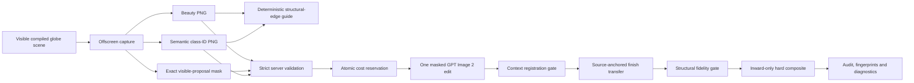

# Complete-site generation and Direct 3D rendering

## Product boundary

This initiative adds two complementary behaviours without changing the proven
colored-polygon renderer:

1. Community 3D compiles every otherwise-unassigned location inside the site
   boundary into deterministic residual landscape.
2. The render panel exposes an isolated **Direct 3D** pipeline that treats the
   visible compiled scene as authoritative and asks GPT Image 2 for either a
   source-anchored finish, a camera-preserving whole-scene presentation, or an
   explicitly projection-changing presentation.

**Classic Polygons remains a separate request contract, hook, endpoint and UI
choice.** Its proven colored-polygon prompts, style behavior and output
contract are unchanged. Direct 3D now supports its own validated scene and
reproject style families without routing through or modifying Classic.

## Residual-landscape contract

The backend performs all topology in a local metric CRS and computes:

`site boundary - union(all physical authored project zones)`

The subtraction is project-wide even during an incremental Community 3D
compile. It repairs invalid inputs, clips authored geometry to the boundary,
unions overlaps once, and preserves Polygon/MultiPolygon topology and holes.
Framework-height guidance is excluded because it is not physical site
occupation.

The complete remainder is assigned once, in precedence order, to foundation,
boulevard, perimeter, lawn or low-groundcover regions. The compiler stores the
result as a versioned, source-hashed recipe on the single authoritative site
boundary. A recipe becomes stale when source geometry or physical zone identity
changes, including undo/redo and history restoration; appearance-only edits do
not invalidate it.

Tree placement is deterministic and metric. Candidate centres must keep the
largest rendered, yawed crown inside the residual geometry, not merely the tree
trunk. The frontend rasterizes a north-up 256/512/1024 classified surface and
places the approved bounded tree instances using object-filtered terrain
sampling.

Legacy projects may derive one editable, provenance-marked metric convex-hull
boundary only when at least two physical polygons define a defensible parcel.
Projects with multiple boundaries fail closed.

## Legacy source-anchored data flow

The browser captures at most 2048 pixels on the long edge. It emits a clean
beauty image, an edit mask for only visible compiled proposal pixels, and a
semantic ID image for ground, landscape, street, park and building classes.
Editor affordances are explicitly excluded. Context geometry renders first to
establish depth/stencil ownership; proposal passes then mark only pixels that
are actually visible. Semantic materials preserve source cutout, sidedness and
depth policies so foliage cards and coplanar public-realm layers do not enlarge
or reorder the mask.

The backend independently validates format, decoded dimensions, pixel count,
aspect ratio, mask coverage, claimed measurements, class IDs and class-to-mask
containment before reserving credits. The server product cap matches the
frontend 2048-pixel capture cap. Oversize, animated and decompression-bomb
images are rejected before full decode.

Every paid request is also bound to the exact persisted scene captured by the
browser. Each physical zone supplies its server-authored source hash and a
generator-specific representation hash; buildings additionally supply the
linked Building ID. The same representation revision is mirrored onto the
Building snapshot, so the client fails closed if its zone and model queries came
from different refreshes. Under one project row lock, the server requires an
exact zone set, recomputes zone geometry/design hashes, recomputes LEGO,
planned-massing or Meshy/LOD representation hashes, and recomputes the residual
parcel hash from the current boundary and every physical zone. Only then may it
reserve credits. LEGO recipe changes, generic visible Building edits, model
library swaps, generated preview/final model writes and sibling propagation use
that same lock and mark linked compiled zones stale. A stale tab therefore gets
a free 409 response before spend instead of rendering a scene it did not claim.

The provider request is deliberately singular: GPT Image 2, high quality,
explicit normalized dimensions, PNG output, beauty plus a semantic class-ID
guide and a deterministic monochrome structural-edge guide. The semantic guide
remains optional for legacy `source_anchored`, but is required for `scene` and
`reproject`. Legacy source-anchored mode also supplies one same-size alpha edit
mask; presentation modes omit it by contract. There is no maskless retry. The structural guide labels each
sizeable visible building/street/park component and preserves source contours;
the prompt treats those labels and class colors as metadata that must never
appear in the result. Provider output is capped at 3,686,400 pixels even though
source validation permits the full 2048 by 2048 safety envelope.

## Presentation v2 modes

The isolated Direct 3D request now has an explicit `presentation_mode` and
`style`. Existing callers remain byte-contract compatible because the default
is `source_anchored` with `photorealistic` style. The Classic Polygons request,
hook and `/render/generate` endpoint are not imported into or modified by this
contract.

The three modes have deliberately different output authority:

| Mode | Provider mask | Camera contract | Accepted pixels | Intended use |
| --- | --- | --- | --- | --- |
| `source_anchored` | Exact visible-proposal mask | Source camera and exterior are pixel locked | Legacy source-phase finish fusion plus inward hard composite | Measurement-sensitive review and the existing Direct 3D behaviour |
| `scene` | Omitted intentionally | Same aspect, framing, horizon and camera after structural-context registration | Registered provider frame, resized back to the exact source dimensions | Presentation-quality photographic or camera-preserving artistic finish |
| `reproject` | Omitted intentionally | Screen-space lock is not applicable; prompt/guides condition layout, but automated checks do not prove preservation | Provider output directly after deterministic content sanity | Experimental orthographic plan, near-nadir, axonometric and maquette transformations requiring human layout review |

All modes make exactly one provider call. Omitting the mask in presentation
modes is intentional, not a mask-error fallback: it permits coherent sky,
terrain, surrounding buildings, roads, planting, light and atmosphere instead
of forcing a visibly different proposal patch into unchanged Google Tiles.

The request accepts the 22 render-panel style IDs. Camera-preserving `scene`
styles comprise Photo Realistic, Photomontage, Development, Atmospheric,
Winter, Night, Watercolour, Charcoal, Marker, Pen & Ink, Survey, Documentary,
Wood Block, Collage, Risograph and Pixel Art. The projection-directed styles
Site Plan, Site Plan Photo, Blueprint, Site Plan Watercolour, Isometric and
Clay Maquette require `reproject`. An incompatible mode/style pair is rejected
before reservation or provider spend. Legacy `source_anchored` remains
unrestricted for backward compatibility with previously approved realistic
treatments.

### Camera-locked scene acceptance

Both presentation modes require a same-size object-ID image and manifest before
provider reservation. Classified object-ID pixels must cover at least 0.85 of
active proposal pixels and must reach proposal/classification IoU of at least
0.84; the existing one-percent classified-pixel leakage ceiling still applies.
This prevents a token class-ID swatch from satisfying the guide requirement.
Coverage and thresholds are exposed in diagnostics. Legacy mode may still omit
the guide or use its prior partial structural guide behavior.

`scene` additionally requires, before spend, mask-zero lower-frame context
covering at least 8% of the complete normalized frame. Preparation and
post-provider validation use the exact same deterministic region: mask-zero
pixels below the 45%-of-height row. This fails early when the proposed geometry
leaves too little non-sky context to prove a coherent full-scene finish.

`scene` uses one concise prompt. The macro-design authority appears once after
the requested treatment and allows new facade/window detail, glazing,
materials, foliage texture, weathering, contact shadows and entourage. It
locks building count, primary silhouettes, footprints, heights, rooflines,
street/path topology, park boundaries, major occlusions, aspect and camera. It
does not repeat the legacy pixel-lock paragraph around the user's prompt.

The unmasked provider frame is first registered against structural edges in
the original context. A provider-first macro gate then compares only design
evidence that should survive a photographic finish:

- proposal silhouette and coarse source edges;
- visible semantic boundaries;
- every sizeable building, street and park component independently; and
- directed source-to-candidate displacement at the reviewed 2 px at 720p,
  scaling to at most 4 px.

Additional material, window and foliage edges are permitted. Source
building-internal/window-edge retention is explicitly **not** required. The
gate requires at least 0.80 silhouette recall, 0.70 coarse recall, 0.78
semantic recall and 0.72 weakest-component recall when those measurements are
available. P90 reference-edge displacement may not exceed the smaller of 6 px
or 2.5 times the scale-aware edge tolerance. These thresholds reject the
retained raw calibration redesign, which at the reviewed 2 px scale records
0.633 silhouette, 0.614 coarse, 0.598 semantic, 0.472 weakest-component recall
and 4.775 px P90 displacement.

Source-directed recall is not sufficient by itself: dense unrelated noise or
stripes can place a false edge near almost every source edge. The macro gate
therefore also measures candidate-to-source precision on **coarse** edges. At
least 0.40 of candidate coarse edges must land within the scale-aware source
edge tolerance, and candidate coarse-edge density may not exceed 3.0 times the
source coarse-edge density. Measuring this reverse direction only at the
coarse scale still permits genuinely new facade, material, foliage and media
texture. Deterministic random-noise and dense-stripe regressions reproduce high
source-directed recall but now fail the reverse-precision requirement.

Known limitation: the current class-ID pass encodes semantic classes, not a
unique ID per design instance. Touching same-class buildings can therefore
form one connected component, so the automated component gate cannot by itself
prove that every attached rowhouse or touching building instance survived. A
focused follow-up must add vectorized RGB instance-label decoding plus
per-instance coarse/internal metrics; simply expanding the color count is not
sufficient. Until then, the global/reverse-edge gates remain in force and the
human composition/inventory scorecard is mandatory.

A separate visual-change floor prevents charging for a result that is merely
the source or a global colour grade. Whole-frame mean absolute RGB change must
reach 5 levels and proposal change must reach 12 levels. The proposal must also
demonstrate spatial detail through either high-frequency-change P75 of at least
3 levels or novel-detail edge coverage of at least 0.0015. A luminance
gain/offset is regressed out first and the remaining proposal residual must
reach a P95 of 6 levels, so exposure, contrast or white-balance changes alone
cannot satisfy the gate.

The retained project `3da536b6-e853-4097-ad78-2eee8d0f3262` legacy finish is
an explicit rejection calibration: whole-frame MAD 1.536, proposal MAD 9.325,
proposal detail P75 2.282, residual P95 18.888 and novel-edge coverage
0.000758. It fails the hard whole-frame, proposal and spatial-detail floors
even though its isolated residual is high.

Changing only the proposal and sky is not a full-scene finish. The visual gate
therefore measures mask-zero context only in the lower 55% of the frame. That
context must reach either mean absolute RGB change of 4 levels or a
gain/offset-regressed residual P95 of 4 levels. It must additionally reach
high-frequency context-change P75 of 0.75 levels, so a flat tint over unchanged
Google photogrammetry cannot satisfy the context branch. Diagnostics expose
every raw measurement, threshold, evaluated context-pixel count and the
lower-frame start fraction.

The common scene thresholds have deterministic acceptance fixtures for both a
softened watercolour treatment and a limited-palette line-art treatment. Both
preserve registration and macro layout while clearing the same visual-change
floor used by photographic styles. Style-specific weakening is therefore not
required; noise, stripes, proposal/sky-only edits and lower-context flat tints
remain explicit rejection fixtures.

Registration retains the legacy service's broad fail-closed safety limits, but
`scene` adds a stricter camera-preservation gate after registration: translation
norm may not exceed 8 px and absolute rotation may not exceed 0.35 degrees.
These tighter limits are scene-only; `source_anchored` registration behavior is
unchanged. Scene registration diagnostics expose both the measured translation
norm and these limits.

Passing `scene` output retains provider-authored photographic pixels across
the full frame. It does not enter source-phase finish fusion and does not
restore mask-zero context. `reproject` bypasses screen registration and macro
pixel comparison because those measurements are invalid after an intentional
camera transformation; the plan/component guides and concise layout authority
remain its design conditioning. It does not accept arbitrary pixels: a
deterministic output-sanity gate rejects unchanged, flat, empty and noise-like
frames using whole-frame change, luminance variance/range, bounded structural
edge coverage, 4-by-4 spatial edge occupancy and a conservative significant-
edge-component floor derived from visible semantic inventory. This gate is an
inventory proxy, not semantic proof; reproject output still requires human
layout/inventory review before release.
The sanity thresholds are whole-frame MAD 8, luminance standard deviation 10,
luminance P95-minus-P5 range 35, edge coverage from 0.002 through 0.30 and at
least four occupied grid cells. The significant-edge-component floor is one to
three components, capped from the source building/street/park component count.
All measurements and thresholds are returned in
`reproject_output_sanity` diagnostics.

Diagnostics identify `processing_mode`, `view_lock`, `context_restyled` and
`provider_first`, plus macro fidelity, threshold values, lower-context evidence
and visual-change measurements where applicable. Legacy finish, edge,
registration and exterior diagnostics remain available unchanged. Successful
audit rows include mode/style and distinguish `source-anchored` from
`provider-first scene` or `provider-first reproject` finals.

## Legacy source-anchored geometry and context safeguards

In `source_anchored` mode, output is registered against immutable context pixels. Near-identity output
passes directly; bounded ECC Euclidean registration may correct only a small
translation/rotation. Low score, excessive drift, excessive rotation, wrong
dimensions or malformed output fail closed.

Provider geometry is never trusted directly in this legacy mode. After registration, the server
extracts only a clipped, mask-aware, low-frequency RGB delta from the provider
image and applies it to the authoritative source. The Gaussian scale is 8 px at
1280 by 720 and scales by image diagonal; buildings use the most conservative
strength. This transfers broad material tone, daylight and atmospheric finish
while source high-frequency roof, facade, path, tree and street geometry stays
in place. Pixels outside the proposal do not participate in the transfer.

Material definition uses a second, source-phase-only stage. The provider's
fine, medium and microtexture bands are reduced to robust contrast statistics
per semantic role; their pixels and spatial phase are never composited. Those
scalar targets can only strengthen bands reconstructed from the source beauty
frame itself. Both source and provider structural edges are protected, role
interiors are eroded and feathered, and every correction has a hard gain and
channel cap. An invented provider roofline, window rhythm, path edge or tree
silhouette therefore has no mechanism to enter the final pixels. Diagnostics
record source-detail correlation, texture gain, eligible coverage and per-role
gains, plus the explicit invariant
`provider_high_frequency_phase_transferred: false`.

A calibrated directed edge gate then compares the fused image with the source
at beauty, coarse, semantic-component and building-internal levels. Semantic
ownership boundaries count only where the source beauty/coarse pass actually
contains a visible edge, so invisible class transitions do not require invented
lines. Any candidate below the reviewed thresholds fails closed after the one
provider call. The server finally composites inward from the proposal mask with
a two-pixel internal feather; every mask-zero exterior pixel is copied from the
source and asserted byte-identical.

The response records both raw-provider and final fused fidelity, finish-transfer
parameters, registration score, translation, rotation, proposal/context
coverage, exterior pixel count and maximum exterior delta, plus SHA-256
input/output fingerprints. The UI identifies when provider geometry was
discarded before its finish was transferred.

The maximum-size 2048 x 1792 fusion path was profiled with all five roles:
3.54 seconds, 125.5 MiB baseline RSS and 476.1 MiB peak RSS. Analysis is
luminance-only and sequential; synthesis retains one source-RGB band at a time,
avoiding the earlier unbounded stack of full-resolution provider/source bands.

## Cost and failure semantics

The endpoint reserves a size- and input-aware Direct 3D token cost and a
global-cap audit row atomically before contacting OpenAI. With SiteForge credits
valued at $0.005, the conservative estimator is `ceil(41 × normalized
megapixels + 4 + 2 when a class-ID input is attached + 2 for the structural
guide)`, with a 13-token floor.
This follows the 2026-07-20 GPT Image 2 high-quality reference prices while
leaving margin for its always-high-fidelity image inputs.

A known pre-send connection failure or explicit known-unbilled client rejection
is refunded and returned as `billed: false`. If OpenAI produced an image but the
local registration/composite safety gate rejects it, the attempt remains
charged and audited and returns `billed: true`. A timeout, protocol failure,
5xx, malformed success, or other post-send state where provider billing cannot
be known conservatively retains the reservation and returns
`direct_3d_billing_unknown`. The UI tells the user before a retry can spend
again. Successful, safety-rejected and billing-unknown attempts remain in the
same audit/cap system; usable provider images are tied to the canonical source
capture.

## UI routing

The render panel presents **Classic Polygons** and **Direct 3D** explicitly.
Direct becomes available only after Community 3D is complete, the capture
bridge is ready, and every compiled building representation is mounted. Its
model visibility is fixed; it cannot silently fall back to colored massing.

Direct mode routing follows the Presentation v2 contract above:

- `source_anchored` preserves the legacy proposal-local realistic finish and
  restores exterior context byte-for-byte;
- `scene` accepts camera-preserving photographic, seasonal, atmospheric and
  art-media whole-frame treatments; and
- `reproject` accepts only the six plan, near-nadir, isometric and maquette
  treatments for which a screen-space camera lock is intentionally invalid.

Classic continues to expose its established colored-polygon styles. Nothing in
Direct changes Classic prompts, style availability or endpoint behavior.

Before spending, **Check Direct Capture** produces the three capture passes and
coverage/class diagnostics locally at no image cost. The paid button always
takes a fresh capture, makes one provider request, saves the result, and displays
mode-appropriate diagnostics. It never reuses the free preview after the camera
may have moved.

## Release gates

The pilot sequence is intentionally finite:

1. focused unit/API tests and type checking;
2. free capture inspection at 30-degree oblique, 60–75-degree steep and
   90-degree overhead cameras;
3. confirm buildings remain mounted through camera changes and panel use;
4. one paid Direct 3D pilot only if beauty, mask and class-ID passes are exact;
5. verify the selected mode's contract: byte-identical exterior and calibrated
   internal-edge diagnostics for `source_anchored`; camera drift, macro,
   bidirectional coarse-edge and full-scene visual-change gates for `scene`;
   deterministic content sanity plus human layout/inventory review for
   `reproject`;
6. compare **Source | Legacy | New | Reference** at the same crop with a human
   four-point scorecard: composition 15%, materials 20%, landscape/public realm
   20%, lighting 15%, context 10%, population 10% and style 10%. Accept only a
   weighted score of at least 3.25/4, every category at least 3, and no red-flag
   artifact. Visible gray/white parcel voids, seams, floating elements, broken
   terrain contact or missing major inventory are automatic failures. Every
   `reproject` result receives explicit human layout/inventory review because
   its automated check is only a content proxy;
7. full relevant tests, production build and diff/status checks before commit.

## Parcel pilot findings

Free capture QA passed at approximately 30-degree oblique, 65-degree steep and
90-degree overhead views with all four building representations, park, street
and residual landscape mounted. Beauty, mask and class-ID passes remained
registered through camera and render-panel changes. The final 1280 x 720
acceptance capture limited the proposal mask to 10.8% of the frame (8.3%
building, 0.8% park, 0.5% street, 0.1% landscape and 1.0% prepared ground), so
the surrounding Google Tiles context remained outside the editable area.

Two bounded paid calls were used during safety calibration. The first cost 44
SiteForge tokens and the second 46, for 90 tokens total ($0.45 at the internal
$0.005/token accounting rate). Both raw provider images substantially merged
or redesigned the four buildings even after the structural guide was added.
That failure established the need for deterministic source authority rather
than prompt-only confidence. No automatic retry occurred.

Both retained raw pilot images still fail the calibrated gate. Their
source-anchored fused counterparts pass: the first records beauty/coarse/
semantic/weakest-component/building recall of 0.971/0.952/0.975/0.969/0.982;
the second records 0.976/0.960/0.992/0.955/0.985. Both keep exterior maximum
channel delta at zero and P90 source-edge displacement at zero pixels. The
source-phase v2 finish also retains source-detail correlation above 0.996 while
raising safe-interior texture P75 by 1.59x and 2.38x respectively. A more
aggressive provider-phase experiment was explicitly rejected after it created
a faint pavilion-roof ghost that ordinary edge recall did not catch. These
historical outputs were reused for offline calibration, so developing the v2
fusion required no additional provider call.

After v2 was integrated, one final bounded paid acceptance call cost 46 tokens
($0.23). The saved source-anchored result reported exterior maximum delta 0,
geometry lock applied, provider geometry discarded before finish transfer,
98.9% building-edge retention and 93.5% semantic-edge retention. It preserved
the four buildings, oval park, street, residual lawn/planting, trees, camera and
exterior context visible in the source capture. Total paid Direct 3D QA was 136
tokens ($0.68): the two intentionally failing calibration calls plus this one
passing release pilot. No automatic retries were made.

The live rebuild also exposed and closed a final client contract issue: inverse
projection repair may validly split a classified residual region into a
MultiPolygon. The decoder, spatial index and scanline rasterizer now accept all
parts and holes rather than incorrectly treating the compiled recipe as stale.
The final verification set passed 147 relevant backend tests, all 445 frontend
tests, TypeScript type checking, the production build, Ruff and Python bytecode
compilation.

## Provider-first presentation acceptance — 2026-07-21

The provider-first `scene` and `reproject` paths were then exercised in the
local City Prompt browser against project
`3da536b6-e853-4097-ad78-2eee8d0f3262`. The bounded batch contained exactly
four paid GPT Image 2 calls at 107 SiteForge tokens each:

- one photographic `scene` attempt was rejected because it materially changed
  the compiled macro geometry (including 39.6% silhouette recall and 15.7 px
  P90 displacement);
- one photographic `scene` attempt passed camera registration, the macro-design
  gate and the full-scene visual-change gate, and was saved to the project;
- one visually strong `winter` scene was rejected because the provider shifted
  the camera beyond the strict 8 px translation limit; and
- one `isometric` `reproject` attempt passed the deterministic output/content
  sanity proxy and was saved with the explicit **human layout review required**
  diagnostic. Manual review confirmed a coherent axonometric presentation of
  the long courtyard-family mass, its repeated green-roof rhythm, the adjacent
  public-realm area and surrounding street/context inventory. This remains a
  presentation acceptance, not a claim of screen-space geometric proof.

There were no automatic retries. The batch used 428 SiteForge tokens, or $2.14
at the internal $0.005/token accounting rate. Accepted output was never created
by weakening a failed gate: the winter camera-drift result and the first
macro-geometry result remain rejected audit artifacts.

Release verification for the provider-first change passed 96 focused backend
render/API tests, 12 focused Direct 3D frontend tests, all six established
Classic Polygons prompt regressions, TypeScript type checking and the production
Vite build. The Classic Polygons request and generation path remain unchanged.
