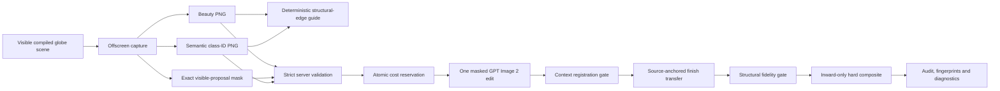

# Complete-site generation and Direct 3D rendering

## Product boundary

This initiative adds two complementary behaviours without changing the proven
colored-polygon renderer:

1. Community 3D compiles every otherwise-unassigned location inside the site
   boundary into deterministic residual landscape.
2. The render panel exposes an isolated **Direct 3D** pipeline that treats the
   visible compiled scene as authoritative and asks GPT Image 2 for finish,
   material and integration work only.

**Classic Polygons remains a separate request contract, hook, endpoint and UI
choice.** It remains the correct pipeline for plan views, camera reprojection,
whole-frame seasons or lighting, and illustration/media transformations.

## Residual-landscape contract

The backend performs all topology in a local metric CRS and computes:

`site boundary - union(all physical authored project zones)`

The subtraction is project-wide even during an incremental Community 3D
compile. It repairs invalid inputs, clips authored geometry to the boundary,
unions overlaps once, and preserves Polygon/MultiPolygon topology and holes.
Framework-height guidance is excluded because it is not physical site
occupation.

The complete remainder is assigned once, in precedence order, to foundation,
boulevard, perimeter, lawn or low-groundcover regions. The compiler stores the
result as a versioned, source-hashed recipe on the single authoritative site
boundary. A recipe becomes stale when source geometry or physical zone identity
changes, including undo/redo and history restoration; appearance-only edits do
not invalidate it.

Tree placement is deterministic and metric. Candidate centres must keep the
largest rendered, yawed crown inside the residual geometry, not merely the tree
trunk. The frontend rasterizes a north-up 256/512/1024 classified surface and
places the approved bounded tree instances using object-filtered terrain
sampling.

Legacy projects may derive one editable, provenance-marked metric convex-hull
boundary only when at least two physical polygons define a defensible parcel.
Projects with multiple boundaries fail closed.

## Direct 3D data flow

The browser captures at most 2048 pixels on the long edge. It emits a clean
beauty image, an edit mask for only visible compiled proposal pixels, and a
semantic ID image for ground, landscape, street, park and building classes.
Editor affordances are explicitly excluded. Context geometry renders first to
establish depth/stencil ownership; proposal passes then mark only pixels that
are actually visible. Semantic materials preserve source cutout, sidedness and
depth policies so foliage cards and coplanar public-realm layers do not enlarge
or reorder the mask.

The backend independently validates format, decoded dimensions, pixel count,
aspect ratio, mask coverage, claimed measurements, class IDs and class-to-mask
containment before reserving credits. The server product cap matches the
frontend 2048-pixel capture cap. Oversize, animated and decompression-bomb
images are rejected before full decode.

Every paid request is also bound to the exact persisted scene captured by the
browser. Each physical zone supplies its server-authored source hash and a
generator-specific representation hash; buildings additionally supply the
linked Building ID. The same representation revision is mirrored onto the
Building snapshot, so the client fails closed if its zone and model queries came
from different refreshes. Under one project row lock, the server requires an
exact zone set, recomputes zone geometry/design hashes, recomputes LEGO,
planned-massing or Meshy/LOD representation hashes, and recomputes the residual
parcel hash from the current boundary and every physical zone. Only then may it
reserve credits. LEGO recipe changes, generic visible Building edits, model
library swaps, generated preview/final model writes and sibling propagation use
that same lock and mark linked compiled zones stale. A stale tab therefore gets
a free 409 response before spend instead of rendering a scene it did not claim.

The provider request is deliberately singular: GPT Image 2, high quality,
explicit normalized dimensions, PNG output, beauty plus an optional semantic
guide, a deterministic monochrome structural-edge guide, and one same-size
alpha edit mask. There is no maskless retry. The structural guide labels each
sizeable visible building/street/park component and preserves source contours;
the prompt treats those labels and class colors as metadata that must never
appear in the result. Provider output is capped at 3,686,400 pixels even though
source validation permits the full 2048 by 2048 safety envelope.

## Geometry and context safeguards

The output is registered against immutable context pixels. Near-identity output
passes directly; bounded ECC Euclidean registration may correct only a small
translation/rotation. Low score, excessive drift, excessive rotation, wrong
dimensions or malformed output fail closed.

Provider geometry is never trusted directly. After registration, the server
extracts only a clipped, mask-aware, low-frequency RGB delta from the provider
image and applies it to the authoritative source. The Gaussian scale is 8 px at
1280 by 720 and scales by image diagonal; buildings use the most conservative
strength. This transfers broad material tone, daylight and atmospheric finish
while source high-frequency roof, facade, path, tree and street geometry stays
in place. Pixels outside the proposal do not participate in the transfer.

Material definition uses a second, source-phase-only stage. The provider's
fine, medium and microtexture bands are reduced to robust contrast statistics
per semantic role; their pixels and spatial phase are never composited. Those
scalar targets can only strengthen bands reconstructed from the source beauty
frame itself. Both source and provider structural edges are protected, role
interiors are eroded and feathered, and every correction has a hard gain and
channel cap. An invented provider roofline, window rhythm, path edge or tree
silhouette therefore has no mechanism to enter the final pixels. Diagnostics
record source-detail correlation, texture gain, eligible coverage and per-role
gains, plus the explicit invariant
`provider_high_frequency_phase_transferred: false`.

A calibrated directed edge gate then compares the fused image with the source
at beauty, coarse, semantic-component and building-internal levels. Semantic
ownership boundaries count only where the source beauty/coarse pass actually
contains a visible edge, so invisible class transitions do not require invented
lines. Any candidate below the reviewed thresholds fails closed after the one
provider call. The server finally composites inward from the proposal mask with
a two-pixel internal feather; every mask-zero exterior pixel is copied from the
source and asserted byte-identical.

The response records both raw-provider and final fused fidelity, finish-transfer
parameters, registration score, translation, rotation, proposal/context
coverage, exterior pixel count and maximum exterior delta, plus SHA-256
input/output fingerprints. The UI identifies when provider geometry was
discarded before its finish was transferred.

The maximum-size 2048 x 1792 fusion path was profiled with all five roles:
3.54 seconds, 125.5 MiB baseline RSS and 476.1 MiB peak RSS. Analysis is
luminance-only and sequential; synthesis retains one source-RGB band at a time,
avoiding the earlier unbounded stack of full-resolution provider/source bands.

## Cost and failure semantics

The endpoint reserves a size- and input-aware Direct 3D token cost and a
global-cap audit row atomically before contacting OpenAI. With SiteForge credits
valued at $0.005, the conservative estimator is `ceil(41 × normalized
megapixels + 4 + 2 when a class-ID input is attached + 2 for the structural
guide)`, with a 13-token floor.
This follows the 2026-07-20 GPT Image 2 high-quality reference prices while
leaving margin for its always-high-fidelity image inputs.

A known pre-send connection failure or explicit known-unbilled client rejection
is refunded and returned as `billed: false`. If OpenAI produced an image but the
local registration/composite safety gate rejects it, the attempt remains
charged and audited and returns `billed: true`. A timeout, protocol failure,
5xx, malformed success, or other post-send state where provider billing cannot
be known conservatively retains the reservation and returns
`direct_3d_billing_unknown`. The UI tells the user before a retry can spend
again. Successful, safety-rejected and billing-unknown attempts remain in the
same audit/cap system; usable provider images are tied to the canonical source
capture.

## UI routing

The render panel presents **Classic Polygons** and **Direct 3D** explicitly.
Direct becomes the default only after Community 3D is complete, the capture
bridge is ready, and every compiled building representation is mounted. Its
model visibility is fixed; it cannot silently fall back to colored massing.

Direct initially permits only proposal-local realistic finishes:

- Photo Realistic
- Development
- Survey
- Documentary

All plan, isometric, night, winter, atmospheric and art-media treatments remain
on Classic because Direct restores the exterior context byte-for-byte and those
treatments require coherent whole-frame change.

Before spending, **Check Direct Capture** produces the three capture passes and
coverage/class diagnostics locally at no image cost. The paid button always
takes a fresh capture, makes one provider request, saves the result, and displays
registration/exterior diagnostics. It never reuses the free preview after the
camera may have moved.

## Release gates

The pilot sequence is intentionally finite:

1. focused unit/API tests and type checking;
2. free capture inspection at 30-degree oblique, 60–75-degree steep and
   90-degree overhead cameras;
3. confirm buildings remain mounted through camera changes and panel use;
4. one paid Direct 3D pilot only if beauty, mask and class-ID passes are exact;
5. verify byte-identical exterior and calibrated internal-edge diagnostics;
6. full relevant tests, production build and diff/status checks before commit.

## Parcel pilot findings

Free capture QA passed at approximately 30-degree oblique, 65-degree steep and
90-degree overhead views with all four building representations, park, street
and residual landscape mounted. Beauty, mask and class-ID passes remained
registered through camera and render-panel changes. The final 1280 x 720
acceptance capture limited the proposal mask to 10.8% of the frame (8.3%
building, 0.8% park, 0.5% street, 0.1% landscape and 1.0% prepared ground), so
the surrounding Google Tiles context remained outside the editable area.

Two bounded paid calls were used during safety calibration. The first cost 44
SiteForge tokens and the second 46, for 90 tokens total ($0.45 at the internal
$0.005/token accounting rate). Both raw provider images substantially merged
or redesigned the four buildings even after the structural guide was added.
That failure established the need for deterministic source authority rather
than prompt-only confidence. No automatic retry occurred.

Both retained raw pilot images still fail the calibrated gate. Their
source-anchored fused counterparts pass: the first records beauty/coarse/
semantic/weakest-component/building recall of 0.971/0.952/0.975/0.969/0.982;
the second records 0.976/0.960/0.992/0.955/0.985. Both keep exterior maximum
channel delta at zero and P90 source-edge displacement at zero pixels. The
source-phase v2 finish also retains source-detail correlation above 0.996 while
raising safe-interior texture P75 by 1.59x and 2.38x respectively. A more
aggressive provider-phase experiment was explicitly rejected after it created
a faint pavilion-roof ghost that ordinary edge recall did not catch. These
historical outputs were reused for offline calibration, so developing the v2
fusion required no additional provider call.

After v2 was integrated, one final bounded paid acceptance call cost 46 tokens
($0.23). The saved source-anchored result reported exterior maximum delta 0,
geometry lock applied, provider geometry discarded before finish transfer,
98.9% building-edge retention and 93.5% semantic-edge retention. It preserved
the four buildings, oval park, street, residual lawn/planting, trees, camera and
exterior context visible in the source capture. Total paid Direct 3D QA was 136
tokens ($0.68): the two intentionally failing calibration calls plus this one
passing release pilot. No automatic retries were made.

The live rebuild also exposed and closed a final client contract issue: inverse
projection repair may validly split a classified residual region into a
MultiPolygon. The decoder, spatial index and scanline rasterizer now accept all
parts and holes rather than incorrectly treating the compiled recipe as stale.
The final verification set passed 147 relevant backend tests, all 445 frontend
tests, TypeScript type checking, the production build, Ruff and Python bytecode
compilation.
