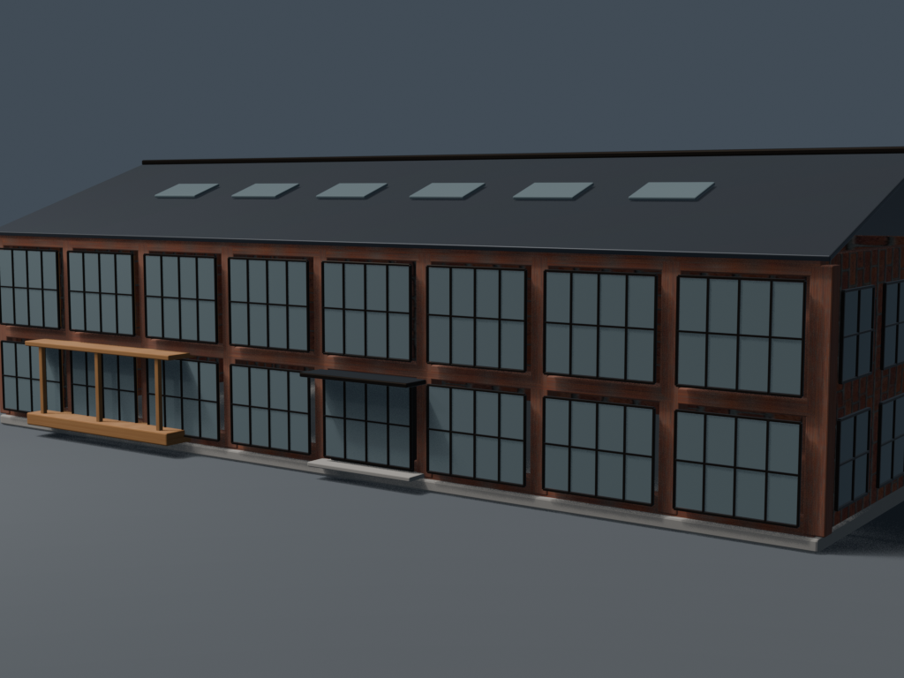
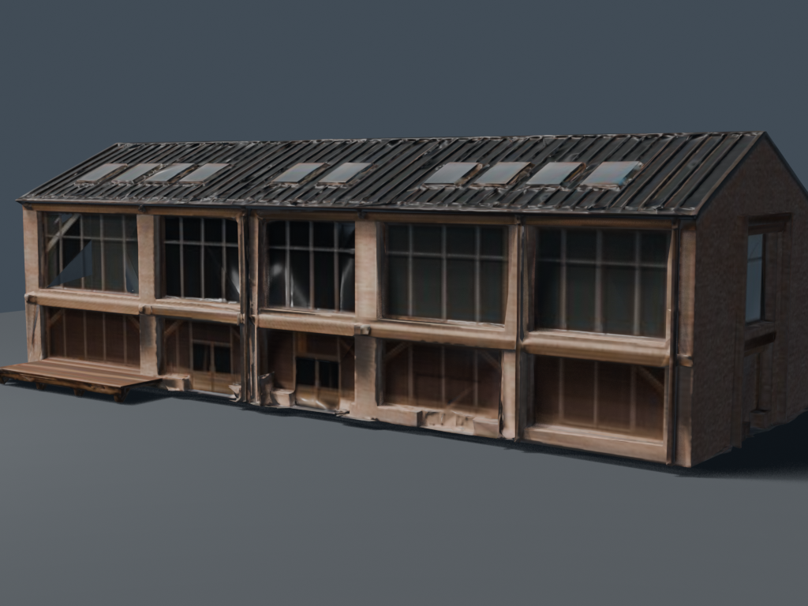
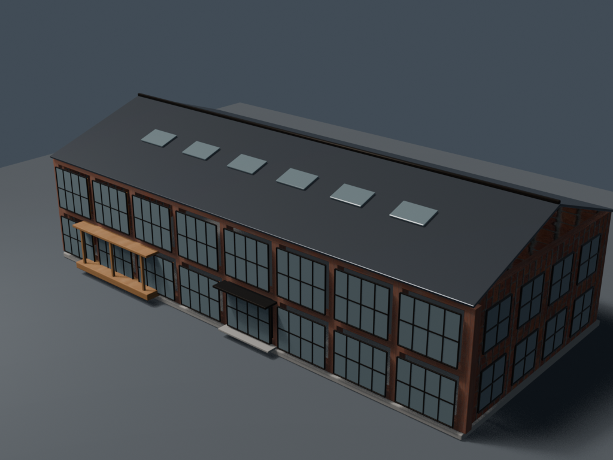
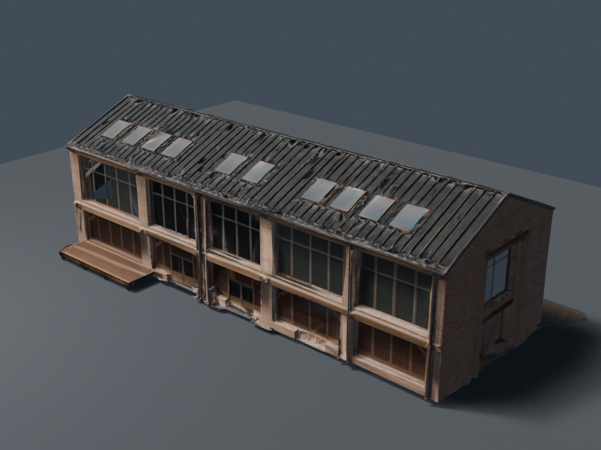
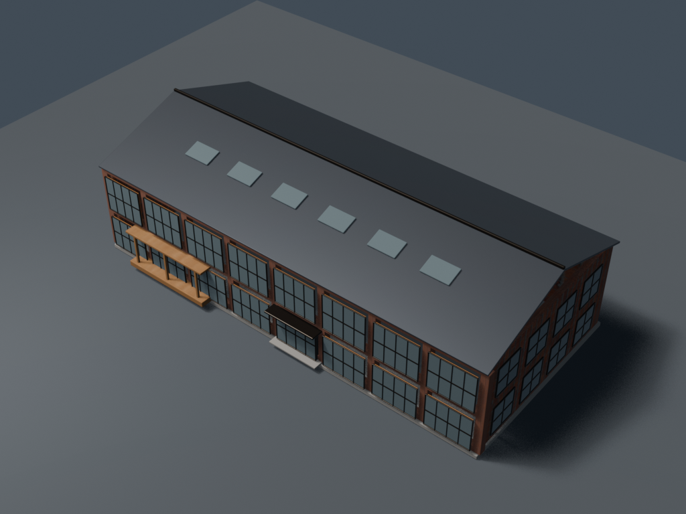
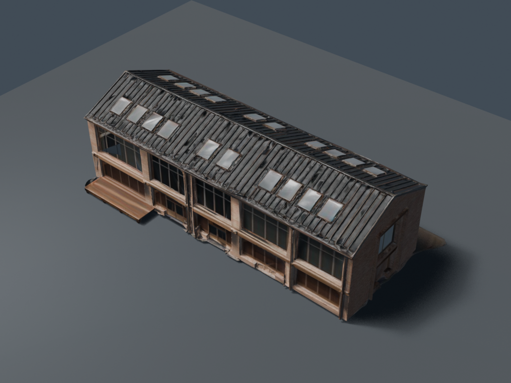

# Fixed GLB pilot: Meshy vs Blender

These are the reviewed comparison renders for the fixed-size building pilot.
Both models represent the same adaptive-reuse warehouse and were normalized to
40 x 20 x 12.5 metres with a bottom-centre placement origin.

The source design reference remains in the catalogue at
[`adaptive_reuse_warehouse_lofts/variant_0.png`](../../frontend/public/archetypes/buildings/adaptive_reuse_warehouse_lofts/variant_0.png).

## Street view

| Blender direct | Meshy, Blender-finished |
| --- | --- |
|  |  |

## Oblique view

| Blender direct | Meshy, Blender-finished |
| --- | --- |
|  |  |

## Aerial view

| Blender direct | Meshy, Blender-finished |
| --- | --- |
|  |  |

## Pilot metrics

| Metric | Blender direct | Meshy, Blender-finished |
| --- | ---: | ---: |
| Runtime GLB size | 2.92 MB | 4.15 MB |
| Triangles | 13,104 | 28,290 |
| Meshes | 7 | 1 |
| Meshy credits | 0 | 39 |
| Fixed-dimension validation | Pass | Pass |

The generated GLBs and working `.blend` files remain outside Git. Only the
reviewed presentation images and reproducible pilot scripts are tracked here.
