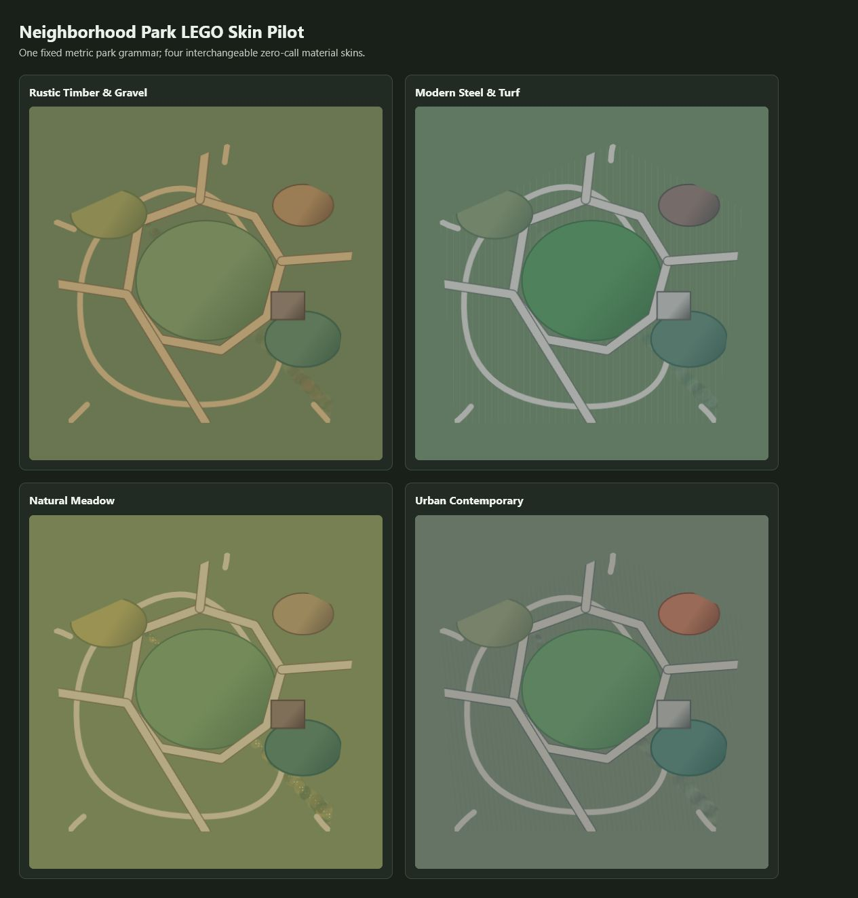

# Neighborhood Park LEGO skin pilot

One fixed neighborhood-park layout rendered with four interchangeable,
zero-call material skins. The path network, lawn, meadow, rain-garden,
playground and pavilion geometry is identical in every panel.

