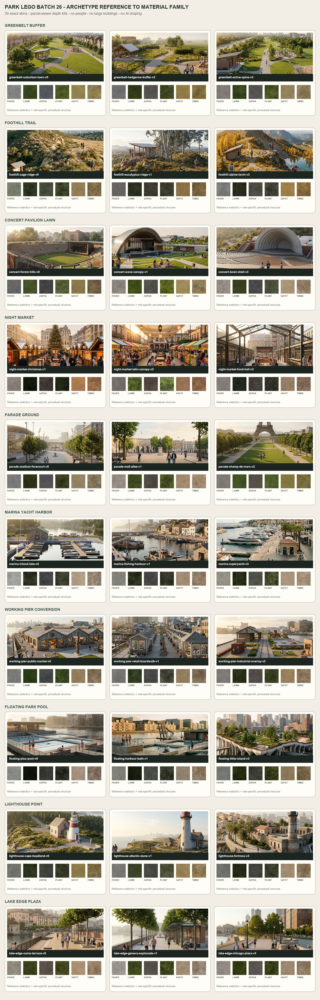
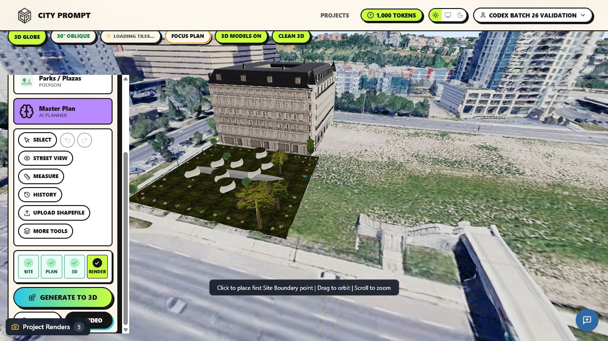

# Park LEGO Batch 26: landscape and waterfront closure

Batch 26 closes all four catalogue variants for ten previously partial park
families. The original reviewed family remains the executable parent; each new
variant receives its own appearance kit, planting structure, program component,
reference-derived six-role PBR skin, and variant-specific parcel-adaptive depth
logic.

| Parent archetype | Executable family | Added variants | Distinguishing composition logic |
| --- | --- | --- | --- |
| Greenbelt Buffer Park | `park_greenbelt_rail_trail_v1` | v0, v2, v3 | suburban lawn/pavilion, hedgerow buffer, active recreation spine |
| Foothill Trail Park | `park_foothill_heathland_trail_v2` | v0, v1, v3 | sage ridge, eucalyptus ridge, alpine larch/scree |
| Concert Pavilion Lawn | `park_concert_timber_lawn_v2` | v0, v1, v3 | horseshoe stadium, steel wave shell, concentric bowl shell |
| Night Market | `park_night_market_hawker_v0` | v1, v2, v3 | Christmas kiosk ring, Latin shade rows, glazed food hall pavilion |
| Parade Ground | `park_parade_national_mall_v3` | v0, v1, v2 | stadium forecourt, gravel allée, formal lawn esplanade |
| Marina Yacht Harbor | `park_marina_pacific_dock_v2` | v0, v1, v3 | inland fingers, fishing quay, wider superyacht docks |
| Working Pier Conversion | `park_working_pier_brooklyn_park_v3` | v0, v1, v2 | public market shed, retail kiosks, retained industrial rails |
| Floating Park Pool | `park_floating_meadow_loop_v2` | v0, v1, v3 | plus pool, harbour bath, tulip-pillar island |
| Lighthouse Point Park | `park_lighthouse_pacific_headland_v2` | v0, v1, v3 | cape cottage, dune station, fortress lighthouse |
| Lake Edge Plaza | `park_lake_edge_timber_deck_v2` | v0, v1, v3 | stone terraces, Geneva quayside pavilions, Chicago hard esplanade |

## Method constraints

- One selected park polygon compiles at a time in visual validation.
- Generate to 3D is the transformation boundary; selection remains a labelled
  mono-colour plan polygon.
- No AI draping or image API calls are used.
- Archetype images guide geometry, spacing, palette, surface texture, and scale.
- Reference people are scale/use evidence only and are not generated.
- Large buildings remain separate building-family outputs; park assemblies use
  only small park structures such as pavilions, stalls, and lighthouse objects.
- The existing family compatibility frame adapts composition to parcel shape;
  it does not stretch a reference plan verbatim.

## Review artifact

The comparison sheet pairs each of the 30 source references with its six
compiled material roles:

The skin compiler reports `api_calls=0` and `source_pixels_projected=false`.
It derives colour statistics from the exact reference and synthesizes
role-specific seamless structure, normal, roughness, and ambient-occlusion maps.

The one-at-a-time City Prompt trial used `floating_park_pool_v3` beside the
existing separately compiled Parisian building. Generate to 3D reported one
building, one park, zero streets, `Assembled 1`, `No family 0`, and `Skipped 0`.
The park resolved to `park_floating_meadow_loop_v2`, used the exact
`floating_park_pool_v3_little_island_skin`, and rendered its planted
tulip-pillar composition without AI draping or people.

