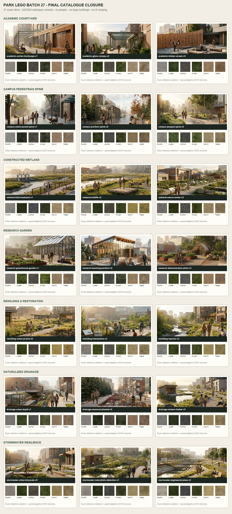
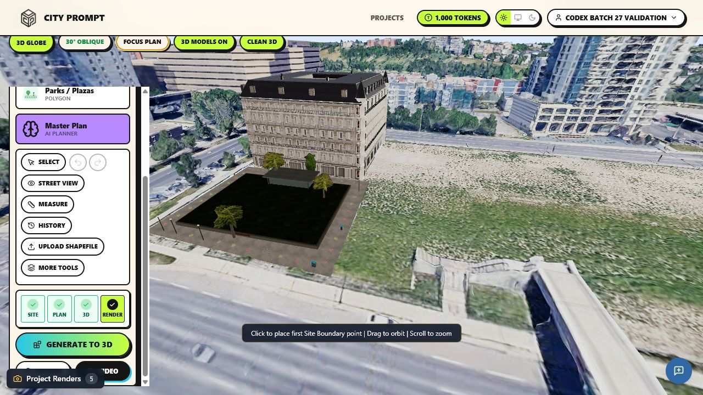

# Park LEGO Batch 27: final catalogue closure

Batch 27 closes the final 21 park variants across seven previously partial
families. Every catalogue selection now resolves to an executable LEGO parent
family, a variant-specific appearance kit and planting structure, a six-role
reference-derived PBR skin, and parcel-adaptive composition logic.

| Parent archetype | Executable family | Added variants | Distinguishing composition logic |
| --- | --- | --- | --- |
| Academic Courtyard | `park_academic_planted_court_v0` | v1, v2, v3 | corten hardscape, glazed canopy, cultural timber screen |
| Campus Pedestrian Spine | `park_campus_green_spine_v0` | v1, v2, v3 | urban paved promenade, glass pavilion node, pergola garden spine |
| Constructed Wetland Eco Park | `park_constructed_wetland_boardwalk_v0` | v1, v2, v3 | tidal treatment channel, wildlife pond/deck, wetland interpretive pavilion |
| Research Garden & Teaching Arboretum | `park_research_arboretum_v0` | v1, v2, v3 | greenhouse plots, teaching pavilion, demonstration beds/trellis |
| Rewilding & Ecological Restoration | `park_rewilding_reforestation_v1` | v0, v2, v3 | open prairie overlook, interpretive nodes, riparian stream/log habitat |
| Naturalized Drainage Corridor | `park_stormwater_natural_creek_v0` | v1, v2, v3 | urban daylit terraces, seasonal planted channel, stream shelter |
| Stormwater Resilience Park | `park_stormwater_arid_channel_v3` | v0, v1, v2 | compact bioswales, naturalistic detention pond, engineered water terraces |

## Method constraints

- Generate to 3D remains the transformation boundary; plan selections remain
  labelled mono-colour polygons.
- One selected park polygon is validated at a time.
- No AI draping or image API calls are used.
- Exact archetype images guide geometry, spacing, palette, material texture,
  feature scale, and how users would move through the park.
- Reference people and animals are scale/use evidence only and are not rendered.
- Large buildings remain separate building-family outputs. Park assemblies use
  only small park structures such as shelters, pergolas, and greenhouses.
- Parcel shape and size control count, repetition, spacing, and orientation;
  reference layouts are interpreted rather than stretched verbatim.

## Review artifact

The comparison sheet pairs every remaining source reference with its six
compiled material roles:

The compiler reports `api_calls=0` and `source_pixels_projected=false`.

The one-at-a-time City Prompt trial used the glazed academic courtyard beside
the existing separately compiled Parisian building. Generate to 3D reported
one building, one park, zero streets, `Assembled 1`, `No family 0`, and
`Skipped 0`. The park compiled to `park_academic_planted_court_v0`, retained
the exact `academic_courtyard_variant_2` identity, and used
`academic_courtyard_v2_glass_canopy_skin` with
`academic_glass_canopy_v2`. No AI drape, people, roads, or embedded large
buildings were generated.

