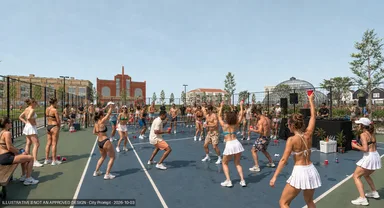
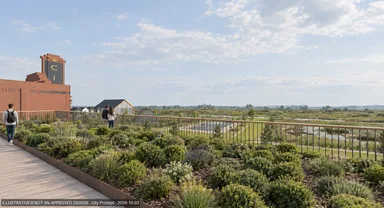
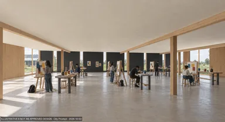
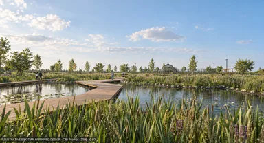
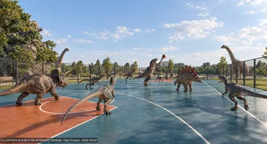
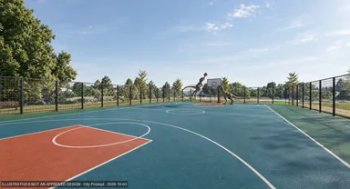
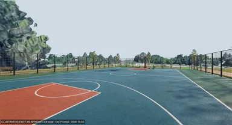

# Renders and edits

[Gallery home](README.md) · [Renders and edits](renders.md) · [3D reference views](scene-references.md)

33 images, newest first. Tap any preview for the full-resolution image. Times are Edmonton local time.

### 01 · Saved edit

October 3, 2026 · 9:11 AM MDT · GPT Image 2.5 Flare

[Open full-size image](https://media.githubusercontent.com/media/aasedor/CityPrompt/codex/browser-render-gallery-2026-10-03/docs/showcase/browser-session-2026-10-03/images/01-2026-10-03-091119-saved-edit-gpt-2.5-flare.png) · 1704 × 923

### 02 · Saved edit

October 3, 2026 · 9:10 AM MDT · GPT Image 2

[Open full-size image](https://media.githubusercontent.com/media/aasedor/CityPrompt/codex/browser-render-gallery-2026-10-03/docs/showcase/browser-session-2026-10-03/images/02-2026-10-03-091056-saved-edit-gpt-2.png) · 1705 × 923

### 03 · AI render

October 3, 2026 · 9:09 AM MDT · GPT Image 2.5 Sunburst

[Open full-size image](https://media.githubusercontent.com/media/aasedor/CityPrompt/codex/browser-render-gallery-2026-10-03/docs/showcase/browser-session-2026-10-03/images/03-2026-10-03-090946-ai-original-gpt-2.5-sunburst.png) · 1920 × 1040

### 05 · AI render

October 3, 2026 · 9:09 AM MDT · GPT Image 2.5 Flare

[Open full-size image](https://media.githubusercontent.com/media/aasedor/CityPrompt/codex/browser-render-gallery-2026-10-03/docs/showcase/browser-session-2026-10-03/images/05-2026-10-03-090904-ai-original-gpt-2.5-flare.png) · 1920 × 1040

### 07 · AI render

October 3, 2026 · 9:08 AM MDT · GPT Image 2

[Open full-size image](https://media.githubusercontent.com/media/aasedor/CityPrompt/codex/browser-render-gallery-2026-10-03/docs/showcase/browser-session-2026-10-03/images/07-2026-10-03-090833-ai-original-gpt-2.png) · 1920 × 1040

### 09 · AI render

October 3, 2026 · 9:06 AM MDT · GPT Image 2.5 Sunburst

[Open full-size image](https://media.githubusercontent.com/media/aasedor/CityPrompt/codex/browser-render-gallery-2026-10-03/docs/showcase/browser-session-2026-10-03/images/09-2026-10-03-090657-ai-original-gpt-2.5-sunburst.png) · 1920 × 1040

### 11 · AI render

October 3, 2026 · 9:06 AM MDT · GPT Image 2.5 Flare

[Open full-size image](https://media.githubusercontent.com/media/aasedor/CityPrompt/codex/browser-render-gallery-2026-10-03/docs/showcase/browser-session-2026-10-03/images/11-2026-10-03-090617-ai-original-gpt-2.5-flare.png) · 1920 × 1040

### 13 · AI render

October 3, 2026 · 9:05 AM MDT · GPT Image 2

[Open full-size image](https://media.githubusercontent.com/media/aasedor/CityPrompt/codex/browser-render-gallery-2026-10-03/docs/showcase/browser-session-2026-10-03/images/13-2026-10-03-090543-ai-original-gpt-2.png) · 1920 × 1040

### 15 · Saved edit

October 3, 2026 · 8:58 AM MDT · GPT Image 2.5 Sunburst

[Open full-size image](https://media.githubusercontent.com/media/aasedor/CityPrompt/codex/browser-render-gallery-2026-10-03/docs/showcase/browser-session-2026-10-03/images/15-2026-10-03-085851-saved-edit-gpt-2.5-sunburst.png) · 1704 × 923

### 16 · Saved edit

October 3, 2026 · 8:58 AM MDT · GPT Image 2.5 Flare

[Open full-size image](https://media.githubusercontent.com/media/aasedor/CityPrompt/codex/browser-render-gallery-2026-10-03/docs/showcase/browser-session-2026-10-03/images/16-2026-10-03-085815-saved-edit-gpt-2.5-flare.png) · 1704 × 923

### 17 · Saved edit

October 3, 2026 · 8:57 AM MDT · GPT Image 2

[Open full-size image](https://media.githubusercontent.com/media/aasedor/CityPrompt/codex/browser-render-gallery-2026-10-03/docs/showcase/browser-session-2026-10-03/images/17-2026-10-03-085750-saved-edit-gpt-2.png) · 1704 × 923

### 18 · AI render

October 3, 2026 · 8:56 AM MDT · GPT Image 2.5 Sunburst

[Open full-size image](https://media.githubusercontent.com/media/aasedor/CityPrompt/codex/browser-render-gallery-2026-10-03/docs/showcase/browser-session-2026-10-03/images/18-2026-10-03-085658-ai-original-gpt-2.5-sunburst.png) · 1920 × 1040

### 20 · AI render

October 3, 2026 · 8:56 AM MDT · GPT Image 2.5 Flare

[Open full-size image](https://media.githubusercontent.com/media/aasedor/CityPrompt/codex/browser-render-gallery-2026-10-03/docs/showcase/browser-session-2026-10-03/images/20-2026-10-03-085605-ai-original-gpt-2.5-flare.png) · 1920 × 1040

### 22 · AI render

October 3, 2026 · 8:55 AM MDT · GPT Image 2

[Open full-size image](https://media.githubusercontent.com/media/aasedor/CityPrompt/codex/browser-render-gallery-2026-10-03/docs/showcase/browser-session-2026-10-03/images/22-2026-10-03-085533-ai-original-gpt-2.png) · 1920 × 1040

### 24 · Saved edit

October 3, 2026 · 8:50 AM MDT · GPT Image 2.5 Sunburst

[Open full-size image](https://media.githubusercontent.com/media/aasedor/CityPrompt/codex/browser-render-gallery-2026-10-03/docs/showcase/browser-session-2026-10-03/images/24-2026-10-03-085019-saved-edit-gpt-2.5-sunburst.png) · 1704 × 923

### 25 · Saved edit

October 3, 2026 · 8:49 AM MDT · GPT Image 2.5 Flare

[Open full-size image](https://media.githubusercontent.com/media/aasedor/CityPrompt/codex/browser-render-gallery-2026-10-03/docs/showcase/browser-session-2026-10-03/images/25-2026-10-03-084946-saved-edit-gpt-2.5-flare.png) · 1704 × 923

### 26 · Saved edit

October 3, 2026 · 8:49 AM MDT · GPT Image 2

[Open full-size image](https://media.githubusercontent.com/media/aasedor/CityPrompt/codex/browser-render-gallery-2026-10-03/docs/showcase/browser-session-2026-10-03/images/26-2026-10-03-084923-saved-edit-gpt-2.png) · 1704 × 923

### 27 · AI render

October 3, 2026 · 8:46 AM MDT · GPT Image 2.5 Flare

[Open full-size image](https://media.githubusercontent.com/media/aasedor/CityPrompt/codex/browser-render-gallery-2026-10-03/docs/showcase/browser-session-2026-10-03/images/27-2026-10-03-084639-ai-original-gpt-2.5-flare.png) · 1920 × 1040

### 29 · AI render

October 3, 2026 · 8:44 AM MDT · GPT Image 2.5 Flare

[Open full-size image](https://media.githubusercontent.com/media/aasedor/CityPrompt/codex/browser-render-gallery-2026-10-03/docs/showcase/browser-session-2026-10-03/images/29-2026-10-03-084405-ai-original-gpt-2.5-flare.png) · 1920 × 1040

### 31 · AI render

October 3, 2026 · 8:38 AM MDT · GPT Image 2.5 Sunburst

[Open full-size image](https://media.githubusercontent.com/media/aasedor/CityPrompt/codex/browser-render-gallery-2026-10-03/docs/showcase/browser-session-2026-10-03/images/31-2026-10-03-083822-ai-original-gpt-2.5-sunburst.png) · 1920 × 1040

### 33 · AI render

October 3, 2026 · 8:35 AM MDT · GPT Image 2.5 Sunburst

[Open full-size image](https://media.githubusercontent.com/media/aasedor/CityPrompt/codex/browser-render-gallery-2026-10-03/docs/showcase/browser-session-2026-10-03/images/33-2026-10-03-083532-ai-original-gpt-2.5-sunburst.png) · 1920 × 1040

### 35 · AI render

October 3, 2026 · 8:28 AM MDT · GPT Image 2.5 Sunburst

[Open full-size image](https://media.githubusercontent.com/media/aasedor/CityPrompt/codex/browser-render-gallery-2026-10-03/docs/showcase/browser-session-2026-10-03/images/35-2026-10-03-082835-ai-original-gpt-2.5-sunburst.png) · 1920 × 1040

### 37 · AI render

October 3, 2026 · 8:20 AM MDT · GPT Image 2.5 Flare

[Open full-size image](https://media.githubusercontent.com/media/aasedor/CityPrompt/codex/browser-render-gallery-2026-10-03/docs/showcase/browser-session-2026-10-03/images/37-2026-10-03-082030-ai-original-gpt-2.5-flare.png) · 1920 × 1040

### 39 · AI render

October 3, 2026 · 8:15 AM MDT · GPT Image 2.5 Flare

[Open full-size image](https://media.githubusercontent.com/media/aasedor/CityPrompt/codex/browser-render-gallery-2026-10-03/docs/showcase/browser-session-2026-10-03/images/39-2026-10-03-081553-ai-original-gpt-2.5-flare.png) · 1920 × 1040

### 41 · AI render

October 3, 2026 · 8:14 AM MDT · GPT Image 2.5 Flare

[Open full-size image](https://media.githubusercontent.com/media/aasedor/CityPrompt/codex/browser-render-gallery-2026-10-03/docs/showcase/browser-session-2026-10-03/images/41-2026-10-03-081445-ai-original-gpt-2.5-flare.png) · 1920 × 1040

### 42 · Final render

October 3, 2026 · 8:14 AM MDT · GPT Image 2.5 Flare

[Open full-size image](https://media.githubusercontent.com/media/aasedor/CityPrompt/codex/browser-render-gallery-2026-10-03/docs/showcase/browser-session-2026-10-03/images/42-2026-10-03-081444-final-render-gpt-2.5-flare.png) · 1920 × 1040

### 43 · AI render

October 3, 2026 · 8:09 AM MDT · GPT Image 2.5 Sunburst

[Open full-size image](https://media.githubusercontent.com/media/aasedor/CityPrompt/codex/browser-render-gallery-2026-10-03/docs/showcase/browser-session-2026-10-03/images/43-2026-10-03-080936-ai-original-gpt-2.5-sunburst.png) · 1920 × 1040

### 45 · AI render

October 3, 2026 · 8:05 AM MDT · GPT Image 2.5 Sunburst

[Open full-size image](https://media.githubusercontent.com/media/aasedor/CityPrompt/codex/browser-render-gallery-2026-10-03/docs/showcase/browser-session-2026-10-03/images/45-2026-10-03-080547-ai-original-gpt-2.5-sunburst.png) · 1920 × 1040

### 47 · Saved edit

October 2, 2026 · 9:40 PM MDT · GPT Image 2.5 Sunburst

[Open full-size image](https://media.githubusercontent.com/media/aasedor/CityPrompt/codex/browser-render-gallery-2026-10-03/docs/showcase/browser-session-2026-10-03/images/47-2026-10-02-214021-saved-edit-gpt-2.5-sunburst.png) · 2086 × 754

### 48 · Saved edit

October 2, 2026 · 9:39 PM MDT · GPT Image 2.5 Sunburst

[Open full-size image](https://media.githubusercontent.com/media/aasedor/CityPrompt/codex/browser-render-gallery-2026-10-03/docs/showcase/browser-session-2026-10-03/images/48-2026-10-02-213902-saved-edit-gpt-2.5-sunburst.png) · 2089 × 753

### 49 · Saved edit

October 2, 2026 · 9:38 PM MDT · GPT Image 2.5 Flare

[Open full-size image](https://media.githubusercontent.com/media/aasedor/CityPrompt/codex/browser-render-gallery-2026-10-03/docs/showcase/browser-session-2026-10-03/images/49-2026-10-02-213832-saved-edit-gpt-2.5-flare.png) · 2087 × 753

### 50 · Saved edit

October 2, 2026 · 9:38 PM MDT · GPT Image 2

[Open full-size image](https://media.githubusercontent.com/media/aasedor/CityPrompt/codex/browser-render-gallery-2026-10-03/docs/showcase/browser-session-2026-10-03/images/50-2026-10-02-213812-saved-edit-gpt-2.png) · 2087 × 754

### 51 · AI render

October 2, 2026 · 9:35 PM MDT · GPT Image 2.5 Sunburst

[Open full-size image](https://media.githubusercontent.com/media/aasedor/CityPrompt/codex/browser-render-gallery-2026-10-03/docs/showcase/browser-session-2026-10-03/images/51-2026-10-02-213556-ai-original-gpt-2.5-sunburst.png) · 1952 × 704

[Gallery home](README.md) · [Renders and edits](renders.md) · [3D reference views](scene-references.md)
