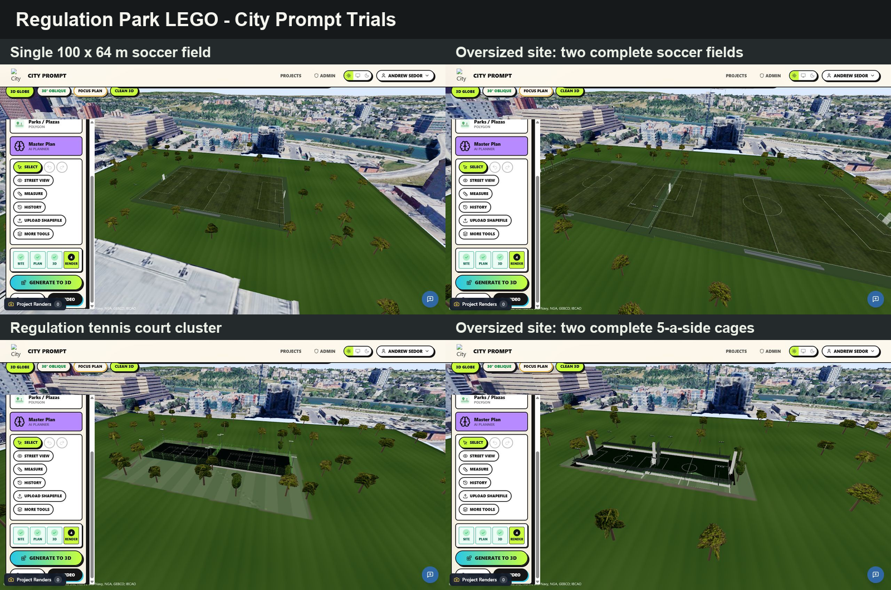

# Regulation Park LEGO — City Prompt Visual QA

Captured from the dedicated `Regulation Park LEGO Trials` City Prompt project on 2026-08-05. Each view shows one active park zone compiled directly to an archetype-owned 3D LEGO family, with no AI drape, people, roads, or separately rendered large buildings. People in the source archetype images remain important analysis references for approximate scale, occupancy, circulation, spectator areas, supervision, and likely use; those observations are translated into LEGO geometry and clearances without rendering the people themselves.

## Mobile comparison sheet

## Full-size captures

- [Single 100 × 64 m soccer field](soccer-single-city-prompt.png)
- [Oversized site with two complete soccer fields](soccer-double-city-prompt.png)
- [Regulation tennis court cluster](tennis-cluster-city-prompt.png)
- [Oversized site with two complete 5-a-side cages](caged-soccer-double-city-prompt.png)

The paired views verify the adaptive rule: larger polygons add complete modules instead of stretching one court or field.
